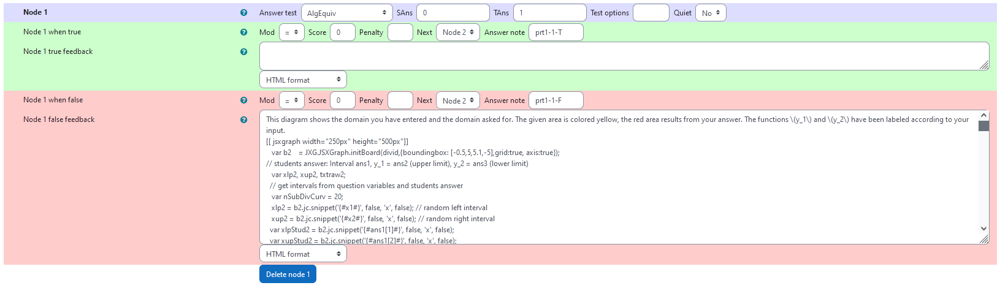

## Aim of task
+ Student knows how a function can be defined on an interval  (Handling mathematical symbols and formalism)
+	Student knows how a function can be transformed and change the graph  (Handling mathematical symbols and formalism)
+	Student knows the graphical representation of some basic functions  (Representing mathematical entities)
+ Student can adapt to errors and correct them based on graphical feedback (Making use of aids and tools)

|  |
|:--:|
| *First impression of the question* |

## Question description

A 2D area is plotted that can be expressed as the space in between an upper and a lower 1D-function. It is the aim of the task to get the correct intervall bounds, correct upper function an correct lower function.

### Student perspective

The student is asked to put in an interval and two functions. They strive to reconstruct the area displayed in the coordinate system by finding the correct functions. If the settings are on "Adaptive Mode" changes can be made after answering and feedback, when "Check" is pressed instead of "Submit and finish".
This way they can learn the best from their mistakes and get it right on the next try.

|  |
|:--:|
| *When the student solves the problem* |


### Teacher perspective
The teacher is able to give a list of different upper and lower functions. Also, they can specify the interval bounds `x1` and `x2` by setting them directly or making changes to the `rand()` function. 
For example, they can replace `x1:rand(4)/2;` by `x1:rand(5);` to go from 1 to 5 in steps of one instead of going from 1/2 to 2 in steps of 1/2 and selecting randomly from the list.
|  |
|:--:|
| *The above image shows which values the teacher may wish to change* |


## Question code

### Question Variables
+	`x1` is a number randomly generated between 1/2 and 2 using the `rand()` function
+	`x2` is a number randomly generated that is always larger than `x1`
+  `yupperlist` is a list containing functions to select from for the upper function
+  `ylowerlist` is a list containing functions to select from for the lower function
+ `yupperfun` is a function randomly selected from `yupperlist`
+ `ylowerfun` is a function randomly selected from `ylowerlist`


#### Question variable code
```
/* interval [x1,x2] */
x1:rand(4)/2;
x2:(rand(4)+3)/2+x1;
yupperlist:[x,(x-x1)^2/2+1,sin(4*x)+2];
ylowerlist:[-x,-(x-x1)^2/2+2,-sin(4*x)];
yupperfun:rand(yupperlist);
ylowerfun:rand(ylowerlist);
```

### Question Text
+	Given is a region of type
```math 
G =\{(x,y)\in\mathbb{R}^2\, |\, a < x < b,\, y_2(x) < y < y_1(x)\}
```
as shown in the diagram. Determine the interval $[a,b]$ and the expressions for the graphs of functions $y_1$ and $y_2$.

Give all numerical values as fractions instead of decimal numbers e.g. <code>1/2</code> instead of <code>0.5</code>.
”
+	JSXGraph applet using the functions and variables defined in **Question variables** plotting the randomized function and allowing the student to type in functions and interval bounds
+	`[[input:ans1]]`,`[[input:ans2]]` and `[[input:ans3]]` within JSXGraph code to allow input of an answer of the student
+	`[[validation:ans1]]`,`[[validation:ans2]]` and `[[validation:ans3]]` checking of answer

#### Question text code


```javascript
Given is a region of type
\[G =\{(x,y)\in\mathbb{R}^2\, |\, a < x < b,\, y_2(x) < y < y_1(x)\}\]
as shown in the diagram. Determine the interval \([a,b]\) and the expressions for the graphs of functions \(y_1\) and \(y_2\).

Give all numerical values as fractions instead of decimal numbers e.g. <code>1/2</code> instead of <code>0.5</code>.
<div  style='float:right'>
<p>\([a,b]\)=[[input:ans1]] [[validation:ans1]]</p>
<p>\(y_1(x)\)=[[input:ans2]] [[validation:ans2]]</p>
<p>\(y_2(x)\)=[[input:ans3]] [[validation:ans3]]</p>
</div>
[[ jsxgraph width="250px" height="400px"]] 
var b1    = JXG.JSXGraph.initBoard(divid,{boundingbox: [-0.5,4.5,5.1,-4.5],grid:true, axis:true,keepAspectRatio:true});
               // some variables
               var nSubDivCurv = 51; // number of points to represent a curve -1
               var cIntArea // Integration area to be plotted by curves of the entered functions
               var yLower, yUpper;
               var txtraw;

               var xlp = b1.jc.snippet('{#x1#}', false, 'x', false); // random left interval
               var xup = b1.jc.snippet('{#x2#}', false, 'x', false); // random right interval
                    b1.suspendUpdate();

                   // to be replace be function from STACK
                    txtraw = '{#ylowerfun#}';
                    //txtraw = '0';
                    txtraw = txtraw.replace(/\s/g, "");
                    yLower = b1.jc.snippet(txtraw, true, 'x', false);

                    // to be replace be function from STACK
                    txtraw = '{#yupperfun#}';
                    //txtraw = '1';
                    txtraw = txtraw.replace(/\s/g, "");
                    yUpper = b1.jc.snippet(txtraw, true, 'x', false);

                    cIntArea = b1.create('curve', [[], []], { strokeWidth: 1, fillColor: 'yellow', fillOpacity: 0.5 });
                    cIntArea.updateDataArray = function () {
                         // generate upper curve
                         var hx = (xup - xlp) / (nSubDivCurv);
                         var pt = xlp;
                         this.dataX = [xlp];
                         this.dataY = [yUpper(xlp)];

                         for (let i = 1; i <= nSubDivCurv; i++) {
                              pt = xlp + i*hx;
                              this.dataX.push(pt);
                              this.dataY.push(yUpper(pt));
                         }

                         // add yLower between xu and xl
                         var hx = (xup - xlp) / (nSubDivCurv);
                         var pt = xup;
                         for (let i = 0 ; i <=  nSubDivCurv ; i++) {
                              pt = xup - i*hx;
                              this.dataX.push(pt);
                              this.dataY.push(yLower(pt));
                         }
                         
                         // close the curve
                         this.dataX.push(this.dataX[0]);
                         this.dataY.push(this.dataY[0]);
                    }; // end cIntArea.updateDataArray

                    b1.unsuspendUpdate();


[[/ jsxgraph ]]
```
## Answers
### Answer ans 1
|property | setting| 
|:---|:---|
|Input type | Algebraic Input|
|Model answer | `[x1,x2]` defined in **Question variables** |
| Forbidden words | none |
| Forbid float | No |
| Student must verify | Yes |
| Show the validation | Yes, with variable list|
--- 

### Answer ans 2
|property | setting| 
|:---|:---|
|Input type | Algebraic Input |
|Model answer | `yupperfun` defined in **Question variables** |
| Forbidden words | none |
| Forbid float | No |
| Student must verify | Yes |
| Show the validation | Yes, with variable list|
--- 

### Answer ans 3
|property | setting| 
|:---|:---|
|Input type | Algebraic Input |
|Model answer | `ylowerfun` defined in **Question variables** |
| Forbidden words | none |
| Forbid float | No |
| Student must verify | Yes |
| Show the validation | Yes, with variable list|
--- 


## Potential response tree
### prt1

|  |
|:--:|
| *Visualization of **prt1*** |

 

|  |
|:--:|
| *Values of **node 1*** |
### Node 1
 |property | setting| 
|:---|:---|
|Answer Test | AlgEquiv|
|SAns | `0`|
|TAns | `1`| 
|Node 1 true feedback | ``|
|Node 1 false feedback | JSXGraph applet showing the student answer|


|  |
|:--:|
| *Values of **node 2*** |

### Node 2
 |property | setting| 
|:---|:---|
|Answer Test | AlgEquiv|
|SAns | `ans1[1]`|
|TAns | `x1`| 
|Node 2 true feedback | `<p>Nice, you found the correct value for \(x_1\)! Good job!</p>`|
|Node 2 false feedback | `<p>The value you gave for \(x_1\) is not correct.  </p>`|

|  |
|:--:|
| *Values of **node 3*** |

### Node 3
 |property | setting| 
|:---|:---|
|Answer Test | AlgEquiv|
|SAns | `ans1[2]`|
|TAns | `x2`| 
|Node 3 true feedback | `<p>Nice, you found the correct value for \(x_2\)! Good job!</p> <p> Perfect! You got both interval bounds right! </p>`|
|Node 3 false feedback | `<p>The value you gave for \(x_2\) is not correct. Make sure, you're giving the values in the format specified in the task explanation.</p>`|

|  |
|:--:|
| *Values of **node 4*** |

### Node 4
 |property | setting| 
|:---|:---|
|Answer Test | AlgEquiv|
|SAns | `ans1[2]`|
|TAns | `x2`| 
|Node 4 true feedback | `<p>Nice, you found the correct value for \(x_2\)! Good job!</p> <p>Check whether you did anything different here than for \(x_1\) and try again. </p>`|
|Node 4 false feedback | `<p>The value you gave for \(x_2\) is also not correct. Make sure, you're giving the values in the format specified in the task explanation.</p>`|


|  |
|:--:|
| *Example for feedback with applet.* |

### prt2

|  |
|:--:|
| *Visualization of **prt2*** |

In this PRT, the student's upper function is checked. Additionally to comparing it to the right answer it is compared to 10 functions with common mistakes. This way the feedback can be given more explicitly, in case the student's error is included in this set.

### prt3

|  |
|:--:|
| *Visualization of **prt3*** |

In this PRT, the student's lower function is checked. Additionally to comparing it to the right answer it is compared to 10 functions with common mistakes. This way the feedback can be given more explicitly, in case the student's error is included in this set.


## Todo:
[] Feedback message of PRT1 is displayed before the applet
